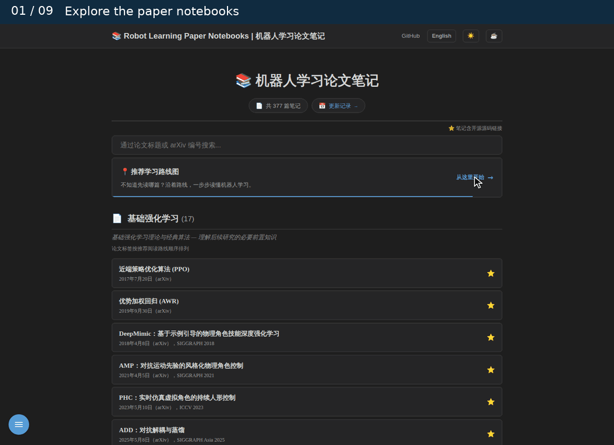

# 📚 每日论文阅读计划

[](https://imchong.github.io/Robot_Learning_Paper_Notebooks/)
[](LICENSE)
[](papers/PROGRESS.md)
[](papers/)

人形机器人学习方向的每日论文精读笔记，逐篇部署为 [在线网页](https://imchong.github.io/Robot_Learning_Paper_Notebooks/)。

**来源**：[awesome-humanoid-robot-learning](https://github.com/YanjieZe/awesome-humanoid-robot-learning) · **待读清单**：[papers/PROGRESS.md](papers/PROGRESS.md)

## 在线演示

[](https://imchong.github.io/Robot_Learning_Paper_Notebooks/)

↑ 点击动图进入[在线站点](https://imchong.github.io/Robot_Learning_Paper_Notebooks/)。展开**推荐学习路线图**了解阅读顺序；按论文标题或 arXiv 编号**即时搜索**；打开笔记后通过**目录**定位章节，点击流程图可进入大图查看器，支持缩放与拖拽。

## 规则

1. 每天早上 7:00 推送当日论文阅读提醒。
2. 回复"理解了"才进入下一篇；当天未回复，次日继续同一篇。
3. 回复"理解了"后，对话记录会一并保存到对应 MD 笔记。
4. 可随时说"读下一篇"跳到下一篇。

## 学习路线图

> 💡 括号内为论文 arXiv 首次发布年份，与首页路线图节点下方的年份小字一致。

```
① 【基础 RL】                    【基础架构】
  PPO (2017) → AWR (2019)          Transformer (2017)  ← 注意力；后文扩散策略 / VLA 的骨架
              ↓
   【人体动作数据层】        ← 模仿类方法开始需要参考数据
  AMASS (2019) / HumanML3D (2022)  →  人体 SMPL 动作数据集
       ↓
   【动作重定向层】          ← 人体骨架 → 机器人骨架的桥梁
  几何重定向 (IK-based)  →  GMR / Retargeting Matters (2025)
       ↓                    ↑ 决定模仿策略的动作质量上限
       ↓
② 【精确模仿主线】        【风格学习主线】
  DeepMimic (2018)  →→→  AMP (2021)
       ↓                    ↓
  PHC (2023)            ADD (2025) / SMP (2025)
                        ↑ SMP：用预训练扩散模型的分数代替判别器，先验冻结后跨任务复用（⇠ Diffusion Policy）
       ↓
③ 【技能组合 / 扩散】
  ASE (2022) → CALM (2023) → PULSE (2023)
  Diffusion Policy (2023) → BeyondMimic (2025)
  AMP (2021) → SMP (2025)           ← 冻结的运动扩散模型当可复用风格奖励（读前先看 Diffusion Policy 的 DDPM 部分）
       ↓
④ 【全身控制 WBC】        ← 把技能 / 扩散策略落到整机关节
  Expressive WBC (2024) → HOVER (2024) / HugWBC (2025) / ExBody2 (2024) / SONIC (2025)
  H2O (2024) → OmniH2O (2024) → HOVER ← HOVER 统一的就是 ExBody / H2O / OmniH2O 等各自的命令空间
  MaskedMimic (2024) → HOVER          ← 仿真角色上「随机遮掉部分目标」的统一控制，HOVER 把这个思路搬到人形
  H2O (2024) → TWIST (2025) → TWIST2 (2025)   ← 动捕 / 便携 VR 全身遥操作，边遥操边采示范
       ↓
   ┌── 从 WBC / 扩散分出多条上行支线，最终都汇聚到 ⑨ ──┐
   │
   ├─ ⑤ 操作 Manipulation：         iDP3 (2024) → EgoMimic (2024) → HumDex (2026)
   │                                （3D 扩散策略 / 自我中心视频 / 灵巧手）
   │                                ACT / ALOHA (2023) → EgoMimic、π₀（动作块的来源；EgoMimic 的策略骨干）
   │
   ├─ ⑥ 移动操作 Loco-Manipulation： HOMIE (2025) → ULTRA (2026) → Ψ₀ (2026)
   │                                （外骨骼遥操作 → 多模态全身控制 → loco-manip 基础模型）
   │                                HOMIE → VIRAL (2025) / DoorMan (2025)（RGB 学生直接输出 HOMIE 控制器的命令）
   │                                HOMIE ⇢ FALCON (2025) ⇢ CHIP (2025)（末端受力：抗扰补偿 → 可调柔顺）
   │                                DeepMimic ⇢ HDMI (2025)（从人类视频学交互：机器人 + 物体一起跟踪）
   │
   └─ ⑦ 世界模型 World Model：       Dreamer / PlaNet (2019) ⇢ UniPi (2023)（潜空间想象学策略 → 文本条件视频当规划器）
                                    Cosmos (2025) → DreamDojo (2026) → 1X World Model (2025)；HAIC (2026)（动力学感知 WM）
            ↓（世界模型"会做梦"预测未来 / 动力学，再升级为可直接当策略的模型）
       ⑧ 世界-动作模型 WAM：         Cosmos → Cosmos Policy (2026)（⇠ Dreamer；视频模型一次后训练兼任策略、世界模型、价值函数）
                                    DreamZero (2026)（World Action Models are Zero-shot Policies）
       ↓
⑨ 【基础模型终点 (VLA / BFM)】   ← 一路从 PPO 爬到这里
  VLA：OpenVLA (2024) → π₀ (2024)       ── 离散 token 自回归 → 流匹配动作块
       π₀ (2024) → π₀.₅ (2025)          ── 流匹配动作专家 → 异构协同训练、开放世界泛化
       π₀ → GR00T N1 (2025)             ── 视觉-语言-动作，端到端通才策略
  BFM：Behavior Foundation Model (2025) ── 行为基础模型 / 全身控制先验
       BFM-Zero (2025)                  ── 无监督 RL 预训练，用目标姿态 / 动作 / 奖励提示调用（⇠ ASE 的技能复用）

【状态估计、硬件与 Sim-to-Real 工程层】  ← 横跨整个路线
  Contact-Aided InEKF (2018 / 2019)  ← IMU + 接触运动学估计身体状态
  Berkeley Humanoid (2024)          ← 硬件、执行器辨识与仿真共同设计；LCP 的部署平台之一
  ToddlerBot (2025)                 ← 校准、数字孪生、遥操作采集与部署工具链
  Domain Randomization (2017) → LCP (2024)
  ↑ sim环境随机化迁移        ↑ 动作平滑，替代低通滤波器
  LCP (2024) → ASAP (2025) ⇢ BeyondMimic
               ↑ delta 动作对齐仿真与真机物理；BeyondMimic 以它为单动作专用方法的对照
  Domain Randomization (2017) → 四足地形 · 教师-学生 (2020) ⇢ HOVER 等 WBC
                               ↑ 特权教师 → 学生蒸馏的源头
  四足地形 · 教师-学生 (2020) → Real-World Humanoid Locomotion (2023)
                               ↑ 从四足换到全尺寸人形：因果 Transformer 读观测—动作历史直接出关节目标
  四足地形 · 教师-学生 (2020) → OP3 Soccer (2023)
                               ↑ 小人形零样本 sim-to-real：技能蒸馏 + 自博弈 + 针对性随机化
```

- **工程层补充 day6**：[InEKF 笔记](papers/09_State_Estimation/Contact-Aided_Invariant_EKF_for_Legged_Robots/Contact-Aided_Invariant_EKF_for_Legged_Robots.md)（以 IJRR 2020 扩展版为准、对照 RSS 2018 会议版，含十二幕动画、三个交互演示与配音视频）、[Berkeley Humanoid 笔记](papers/12_Hardware_Design/Berkeley_Humanoid_A_Research_Platform_for_Learning-based_Control/Berkeley_Humanoid_A_Research_Platform_for_Learning-based_Control.md)（以 arXiv v1 为准、对照 ICRA 2025 版与官方训练代码，含十二幕动画、三个交互演示与配音视频）、[ToddlerBot 笔记](papers/12_Hardware_Design/ToddlerBot_Open-Source_ML-Compatible_Humanoid_Platform_for_Loco-Manipulation/ToddlerBot_Open-Source_ML-Compatible_Humanoid_Platform_for_Loco-Manipulation.md)（以 arXiv v4 / CoRL 2025 版为准、对照 v1 与官方代码 2.0，含十二幕动画、三个交互演示与配音视频）。[发布计划](scripts/paper_video/RELEASE_PLAN.md)将三篇安排在 ASAP → BeyondMimic 之后、动作数据之前；这是教学排序。首页的 LCP → Berkeley Humanoid 连线标明「部署平台」，InEKF 与 ToddlerBot 作为工程层独立节点；三篇笔记都已建好。
- **动作重定向单列一层**：精确模仿 / 风格学习 / 遥操作都依赖"人体动作 → 机器人可执行轨迹"的转换，重定向质量直接决定下游策略能学到什么动作。
- **从 WBC 上行到基础模型**：全身控制把底层技能 / 扩散策略落到整机关节后，分出操作、移动操作、世界模型等支线，最终都汇聚到 VLA（π₀ / π₀.₅ / GR00T N1）与 BFM（行为基础模型）这一顶点。
- **SMP 放在扩散层**：它沿用 AMP 的「风格奖励 + 任务奖励」，但打分器换成预训练后冻结的运动扩散模型（SDS 噪声残差），一个先验可复用到多任务、多风格，训练策略时不再需要原始数据。
- **Transformer 单列为基础架构**：它不是 RL 论文，但扩散策略的 Transformer 变体、π₀ 的 Gemma 主干、GR00T N1 的 DiT 动作头都直接用这套块，读 VLA 之前先读它。

### 基础强化学习 · 官方源码 / MimicKit

笔记涉及的算法，**如果**在 [MimicKit](https://github.com/xbpeng/MimicKit)（xbpeng 的运动模仿框架，支持 Isaac Gym / Isaac Lab / Newton）中有官方实现，会附「📁 MimicKit 源码对照」章节，含关键代码块、YAML 配置与训练 / 测试命令。下表中 ✅ 表示已被 MimicKit 覆盖，❌ 表示有独立官方仓库、不在 MimicKit 内。

| 论文 | 官方源码 | MimicKit | 核心实现 / 入口 |
|------|----------|:--------:|-----------------|
| PPO | [openai/baselines](https://github.com/openai/baselines/tree/master/baselines/ppo2) | ✅ | `mimickit/learning/ppo_agent.py` |
| AWR | [xbpeng/awr](https://github.com/xbpeng/awr) | ✅ | `mimickit/learning/awr_agent.py` |
| DeepMimic | [xbpeng/MimicKit](https://github.com/xbpeng/MimicKit) | ✅ | `mimickit/envs/deepmimic_env.py` + `ppo_agent.py` |
| AMP | [nv-tlabs/ASE](https://github.com/nv-tlabs/ASE)（含 AMP） | ✅ | `mimickit/learning/amp_agent.py` |
| ASE | [nv-tlabs/ASE](https://github.com/nv-tlabs/ASE) | ✅ | `mimickit/learning/ase_agent.py` |
| ADD | [xbpeng/MimicKit](https://github.com/xbpeng/MimicKit) | ✅ | `mimickit/learning/add_agent.py` |
| SMP | [xbpeng/MimicKit](https://github.com/xbpeng/MimicKit) | ✅ | `mimickit/learning/smp_agent.py` + `tools/diffusion_model/train_tinymdm.py` （配置 `data/agents/smp_task_humanoid_agent.yaml`） |
| LCP | [zixuan417/smooth-humanoid-locomotion](https://github.com/zixuan417/smooth-humanoid-locomotion) | ✅ | `mimickit/learning/lcp_agent.py` |
| PHC | [ZhengyiLuo/PHC](https://github.com/ZhengyiLuo/PHC) | ❌ | `phc/learning/amp_network_pnn_builder.py`（独立仓库） |
| CALM | [NVlabs/CALM](https://github.com/NVlabs/CALM) | ❌ | IsaacGym 独立实现，不在 MimicKit |
| PULSE | [ZhengyiLuo/PULSE](https://github.com/ZhengyiLuo/PULSE) | ❌ | `phc/learning/amp_network_z_builder.py`（基于 PHC 扩展） |
| Diffusion Policy | [columbia-ai-robotics/diffusion_policy](https://github.com/columbia-ai-robotics/diffusion_policy) | ❌ | 视觉模仿学习框架，与 MimicKit 定位不同 |
| BeyondMimic | [HybridRobotics/whole_body_tracking](https://github.com/HybridRobotics/whole_body_tracking)（训练）· [motion_tracking_controller](https://github.com/HybridRobotics/motion_tracking_controller)（部署） | ❌ | Isaac Lab + RSL-RL；引导扩散部分尚未单独开源 |
| Domain Randomization | 无官方代码，可参考 [matwilso/domrand](https://github.com/matwilso/domrand) | N/A | 作为通用技术体现在各 env 的 `events` 中 |
| MimicKit | [xbpeng/MimicKit](https://github.com/xbpeng/MimicKit) | ✅ | 框架本身，汇总上表 ✅ 项 |

### ⭐ 高影响力精选

主线之外的重点补充阅读，按子模块与发表时间（旧→新）排列，跟踪进度见 [PROGRESS.md](papers/PROGRESS.md)：

- **全身控制核心**：[Expressive WBC](https://arxiv.org/abs/2402.16796) · [MaskedMimic](https://arxiv.org/abs/2409.14393) · [HOVER](https://arxiv.org/abs/2410.21229) · [ExBody2](https://arxiv.org/abs/2412.13196) · [UH-1](https://arxiv.org/abs/2412.14172) · [HugWBC](https://arxiv.org/abs/2502.03206) · [SONIC](https://arxiv.org/abs/2511.07820)
- **遥操作与模仿学习**：[ACT / ALOHA](https://arxiv.org/abs/2304.13705) · [H2O](https://arxiv.org/abs/2403.04436) · [OmniH2O](https://arxiv.org/abs/2406.08858) · [iDP3](https://arxiv.org/abs/2410.10803) · [HOMIE](https://arxiv.org/abs/2502.13013)
- **行走经典**：[Learning Quadrupedal Locomotion](https://arxiv.org/abs/2010.11251) · [Real-World Humanoid Locomotion](https://arxiv.org/abs/2303.03381) · [Locomotion as Next Token Prediction](https://arxiv.org/abs/2402.19469) · [Humanoid Parkour](https://arxiv.org/abs/2406.10759) · [15-Minute Sim-to-Real](https://arxiv.org/abs/2512.01996) · [ECO](https://arxiv.org/abs/2602.06445)
- **仿真到现实与基座模型**：[Agile Motor Skills (ANYmal)](https://arxiv.org/abs/1901.08652) · [Dreamer](https://arxiv.org/abs/1912.01603) · [UniPi](https://arxiv.org/abs/2302.00111) · [OP3 Soccer](https://arxiv.org/abs/2304.13653) · [OpenVLA](https://arxiv.org/abs/2406.09246) · [π₀](https://arxiv.org/abs/2410.24164) · [ASAP](https://arxiv.org/abs/2502.01143) · [GR00T N1](https://arxiv.org/abs/2503.14734) · [π₀.₅](https://arxiv.org/abs/2504.16054) · [Behavior Foundation Model](https://arxiv.org/abs/2509.13780) · [Cosmos Policy](https://arxiv.org/abs/2601.16163) · [Perceptive BFM](https://arxiv.org/abs/2606.08059)
- **仿真平台与工具**：[Humanoid-Gym](https://arxiv.org/abs/2404.05695) · [BEHAVIOR Robot Suite](https://arxiv.org/abs/2503.05652) · Isaac Lab · [ProtoMotions3](https://nvlabs.github.io/ProtoMotions/)

## 笔记说明

每篇笔记结构统一，兼顾深度理解与面试准备：

- **正文**：基本信息 → 一句话总结 → 英文缩写速查 → 问题背景（生活化类比）→ 方法详解（公式 / 图表）→ 具体实例（数值走通）→ 工程价值 →（可选）MimicKit 源码对照 → 面试高频 Q&A → 讨论记录。
- **附录**（按需）：算法变体、Loss 完整拆解、网络架构、超参数速查表、训练可视化、实验结果、相关工作。

## 项目结构

```
papers/          # 论文笔记，按方向分 14 个目录（01_基础RL … 14_人体运动）
                 # 另含 PROGRESS.md（全量进度表）与 todos/（开发待办）
scripts/         # prepare_pages.py 等预处理 / 部署脚本
_data/ _includes/ _layouts/ assets/   # Jekyll 站点数据、模板与样式
_config.yml      # Jekyll 配置（baseurl = /Robot_Learning_Paper_Notebooks）
```

> 协作与工程规范（Spec/TDD、Code Review、站点构建与截图验收等）见 [AGENTS.md](AGENTS.md)。
